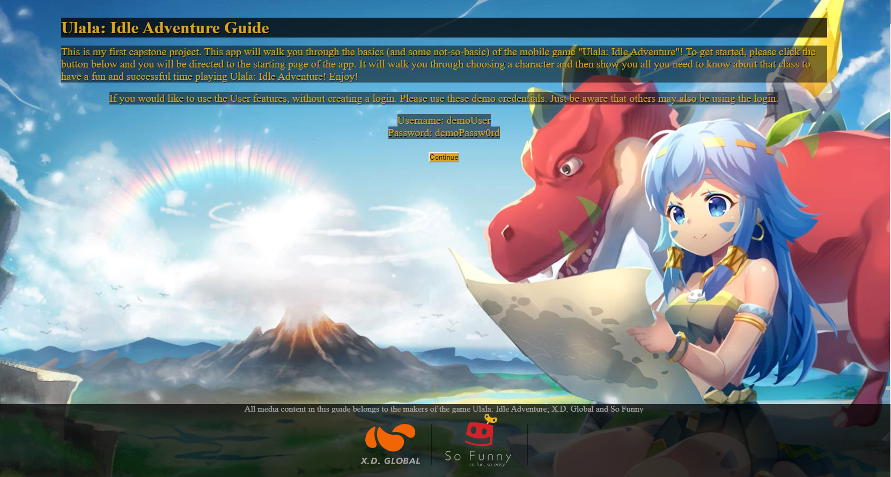
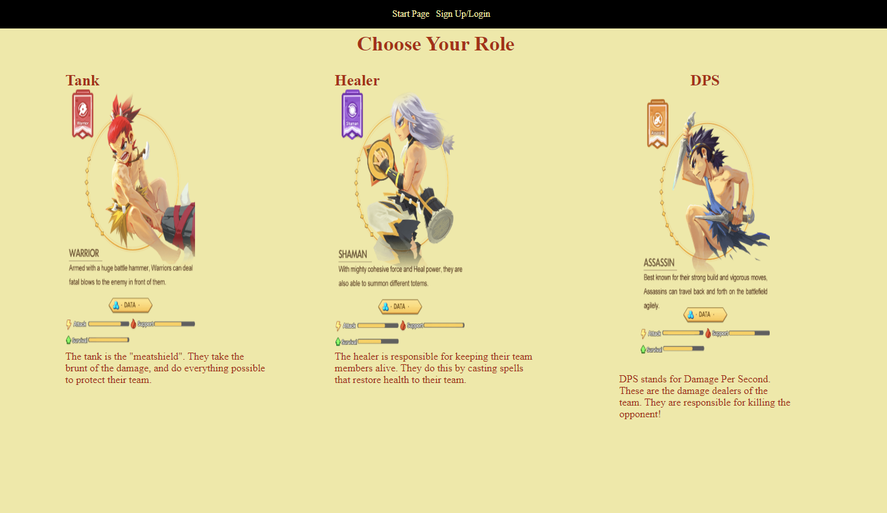
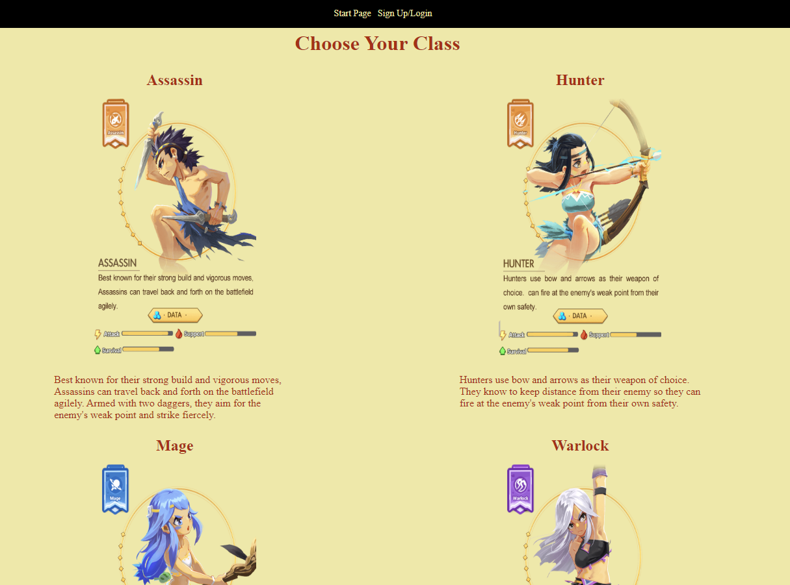
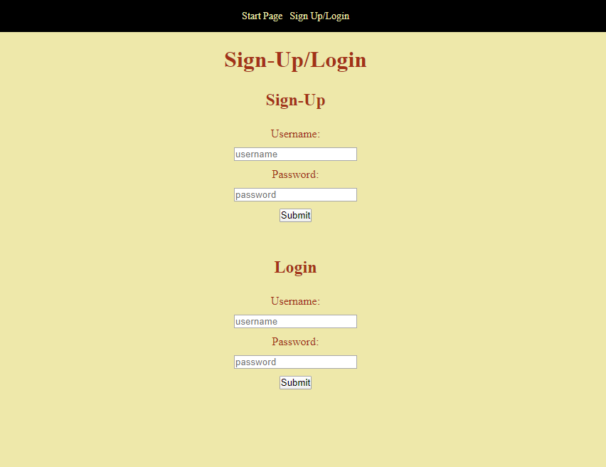
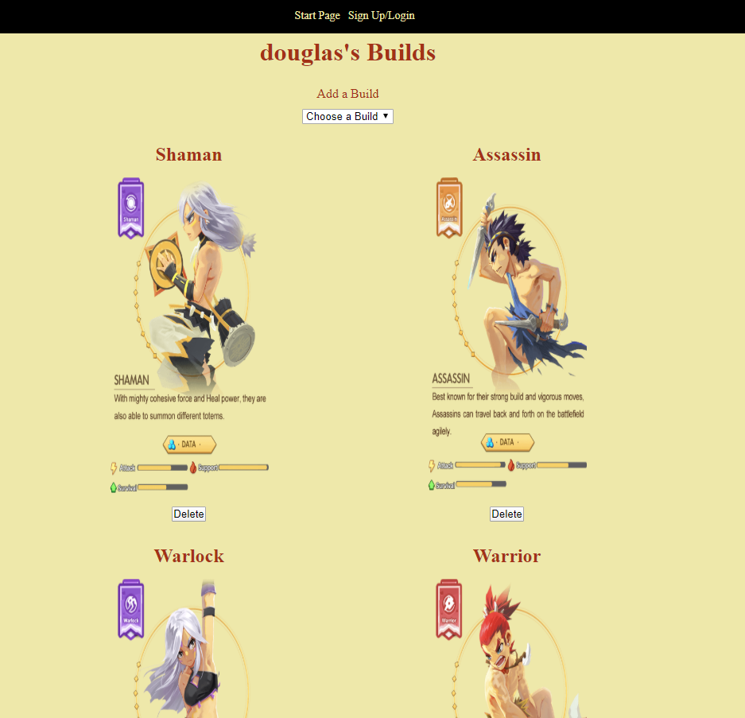

# Ulala: Idle Adventure Guide

## Welcome to my new players guide to the mobile game Ulala: Idle Adventure!

https://ulala-guide.now.sh/

This app is designed to be an interactive walkthrough guide for the Ulala: Idle Adventure Mobile game.
It allows you to pick your role and your class, and then view all of the related resources available
to that class.  There are 3 roles: Tank, Healer, and DPS.  Each role has between 2 and 4 classes that
you can choose from.

When viewing the class page, you can see all the skills, and click on a button that will filter out
only the recommended skills for maximum output (be it better healing, better damage, or better tankyness).
It will also show you the recommended items for the other available resources: Attributes, Tempers, and
Clatter Cards.

The UserBuild pages are the protected endpoints after you login or sign up. They present either a build
selection page, where you can add pre-defined builds to your collection, or remove them. If you click on
one of the builds it will take you to a streamlined build for that class, providing only the basic info
for all of the different aspects of the class.

This guide is currently a work in progress! There will be more features coming (hopefully soon) including
the ability to provide your current skills that you have in the game, and running your skills through a 
damage/healing/mitigation calculator that will spit out the best skills for you to use, and ideally, what
order you should use them in.

### Screenshots

#### Start Page

#### Role Select

#### Class Select

#### Login/Register

#### Build Select

#### User Build

### Tech I used in this project includes:
HTML, CSS, JSX, JavaScript, NodeJS, NPM, React, React Router, Postgrator, and Knex

